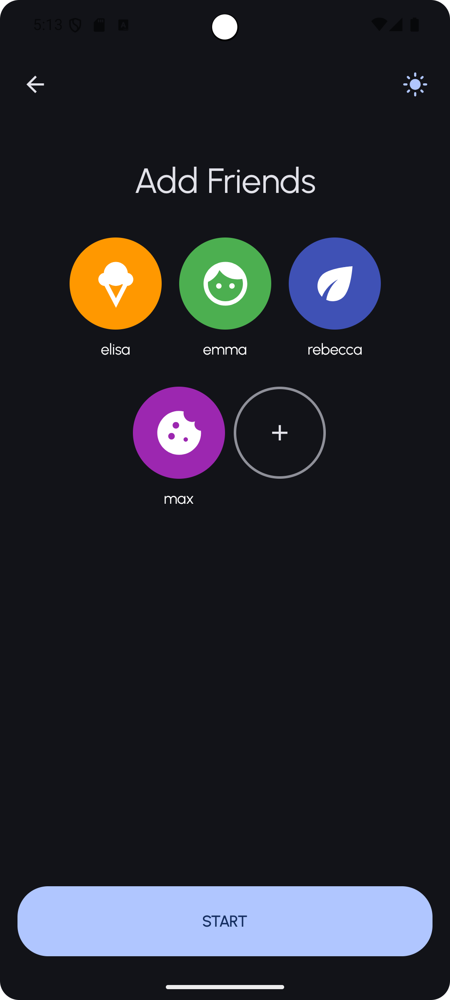
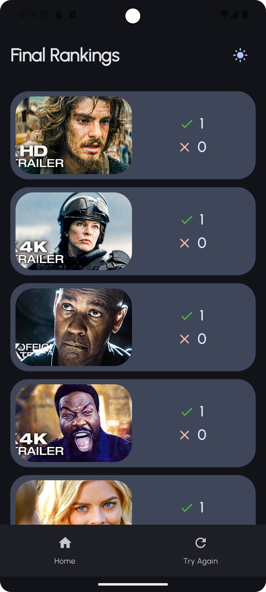

# Ciardulli Elisa - Movie Night

## Name
Movie Night Picker and Explorer

## Description
The main goal of this application is helping users decide, either alone or as a group, which movie to watch. This decision is simplified through a simple voting and ranking system.

A secondary purpose of the app is discovering new movies and keeping track of them in a watchlist or setting them as already watched.

## Movie Night Demo

## Installation
1. Clone the GitLab repository
2. Open the repository with Android Studio
3. Run the App (either on a physical device or an emulator)

## Usage

### The "Movie Night Event"
1. **Assemble the group**: 

    Add participants to a new session

    

2. **Generate Movies**: 

    The app fetches a finite list of random movies

3. **Start Voting**:

    Each round a different participant votes "Yes" or "No" on each movie in the list

    

4. **Final Ranking**: 

    Show the list of movies sorted first by most likes, then by least dislikes and finally by the movie id

    

### Movie Exploration

The home screen loads lists of random movies divided by genres, this is where the user can discover new movies.

You can also always open the details of a movie by clicking on it. This will show you some more information about the movie:
- Title
- Genres
- Saved or not
- Watched or not

### Movie Management

In the app the user can tag movies as:
- **Watched**: to remember that they have already watched this movie
- **To Watch**: to add it to the Watchlist, which is also displayed in the home page

## Author
Elisa Ciardulli

## Project status
This project is complete, but could use a couple of improvements.